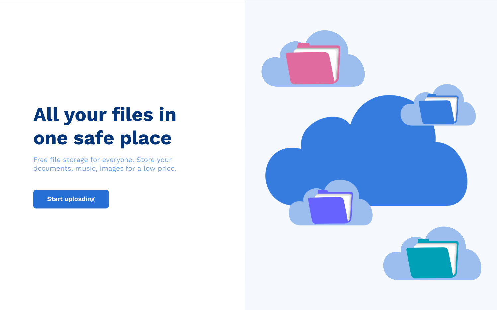
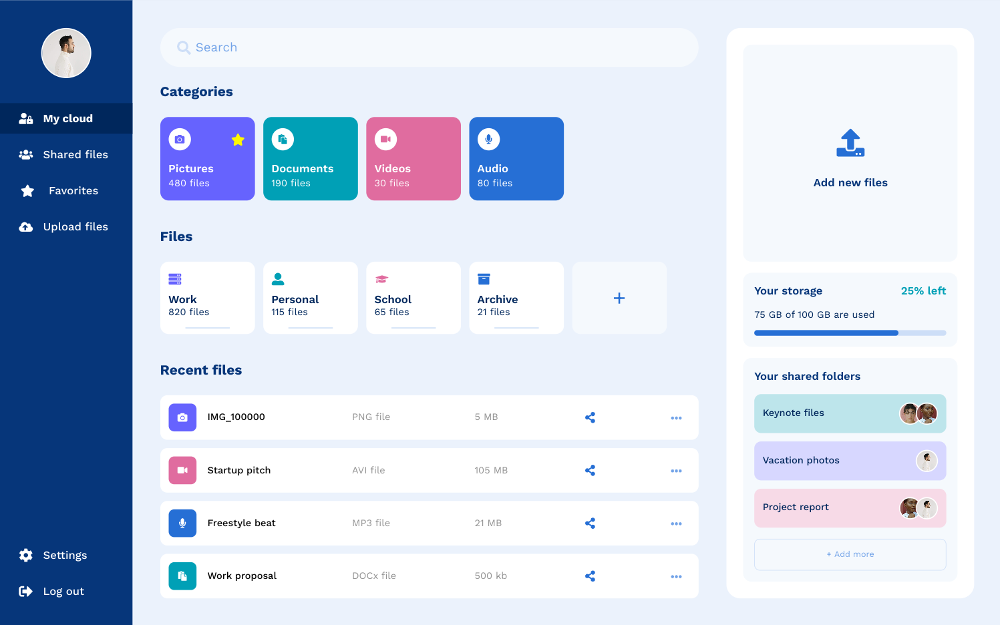
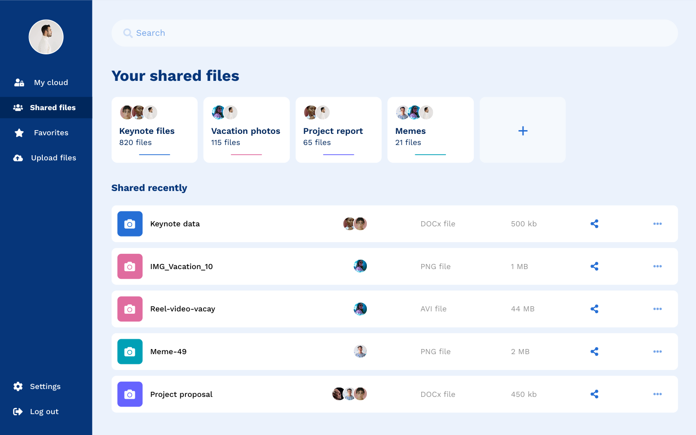
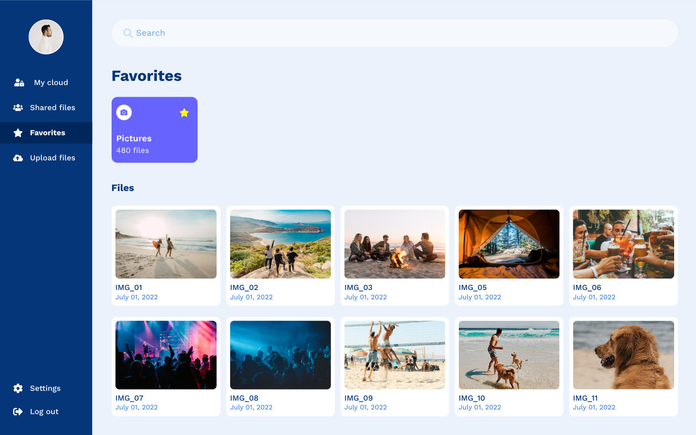
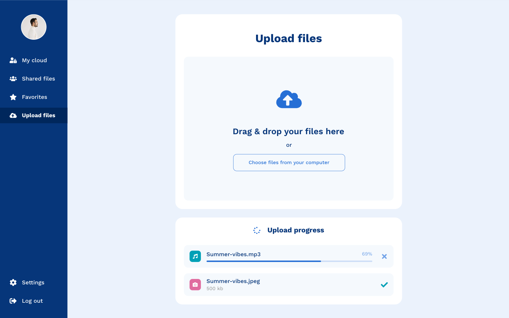

# dCloud

dCloud is a cutting-edge cloud storage solution that leverages the power of IPFS for secure, decentralized file storage.
It has features like file upload, download, sharing, deletion, etc. You can store unlimited files securely and access them from anywhere in the world.

### UI

    

        
        
    

    

        
        
    

    

        
        
    

## Backend: [here](https://github.com/nayanprasad/dCloud-backend)
